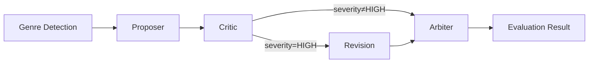

# venus-core

**AI Photography Evaluation Engine** — A multi-agent adversarial evaluation system for professional photography scoring.

[English](./README.md) | [中文](./README.zh-CN.md)

[](./LICENSE)
[](https://www.npmjs.com/package/@theogony/venus-core)
[](https://www.typescriptlang.org/)

---

## Overview

Venus Core implements a **four-round adversarial evaluation pipeline** for professional photography assessment:



| Round | Agent | Role |
|------:|-------|------|
| 0 | Genre Detector | Auto-detects the photography genre via VLM (optional) |
| 1 | **Proposer** | Analyzes the image and produces an initial score with per-dimension breakdowns |
| 2 | **Critic** | Challenges the proposal, identifying scoring biases and errors |
| 3 | **Revision** _(conditional)_ | If the critique severity is `HIGH`, the proposer revises its assessment |
| 4 | **Arbiter** | Makes the final ruling, synthesizing all preceding evidence |

The engine supports **8 photography genres**, each with genre-specific scoring dimensions, scene subtypes, and professional evaluation standards.

## Features

- **Multi-Agent Adversarial Pipeline** — Proposer → Critic → Revision → Arbiter ensures robust, bias-mitigated scoring
- **8 Photography Genres** — Portrait, Landscape, Documentary, Fine Art, Commercial, Architecture, Nature, Sports
- **Multi-Model Routing** — Per-agent model selection and per-agent custom LLM providers
- **Dual Evaluation API** — `evaluate()` for synchronous results, `evaluateStream()` for SSE-ready streaming
- **Streaming Granularity** — Two streaming modes: `values` (milestone events only) and `updates` (real-time thinking + JSON partials)
- **Context Extension** — Rich `EvaluationContext` with EXIF metadata, user notes, and custom data with genre-aware injection depth
- **Event System** — `onEvent` callback for real-time observability into each pipeline stage
- **Web Framework Adapters** — First-class Hono and Express integration with shared Zod validation
- **Chain-of-Thought** — Per-agent thinking/reasoning budget with cross-model CoT extraction
- **Dynamic Zod Schemas** — Per-genre schema generation with caching for input and output validation
- **Structured Errors** — Fine-grained error hierarchy with provider-level error codes
- **Full TypeScript** — Complete type definitions for all public APIs

## Quick Start

```bash
npm install @theogony/venus-core
# or
bun add @theogony/venus-core
```

```ts
import { createVenusEngine } from '@theogony/venus-core';

const engine = createVenusEngine({
  baseURL: 'https://dashscope.aliyuncs.com/compatible-mode/v1',
  apiKey: process.env.API_KEY!,
  defaultModel: 'qwen3-vl-flash',
});

const result = await engine.evaluate('https://example.com/photo.jpg');
console.log(result.totalScore);        // 8.2
console.log(result.genre);             // 'landscape'
console.log(result.dimensions);        // { composition_depth: 8.5, ... }
console.log(result.critique);          // Detailed textual critique
console.log(result.suggestions);       // Improvement suggestions
console.log(result.arbitrationNotes);  // Arbiter's rationale
```

---

## API Reference

### Core Engine

#### `createVenusEngine(config: VenusEngineConfig): VenusEngine`

Factory function to create an engine instance.

#### `engine.evaluate(imageUrl, genre?, context?): Promise<EvaluationResult>`

Run a full evaluation. Returns when all rounds complete.

| Parameter | Type | Description |
|-----------|------|-------------|
| `imageUrl` | `string` | URL of the image to evaluate |
| `genre` | `Genre` | Optional genre override; auto-detected if omitted |
| `context` | `EvaluationContext` | Optional context with EXIF data, user notes, and custom metadata |

Returns `EvaluationResult`:

```ts
interface EvaluationResult {
  imageUrl: string;
  genre: Genre;
  sceneType: string;
  totalScore: number;
  dimensions: Record<string, number>;
  critique: string;
  suggestions: string;
  arbitrationNotes: string;
  process: {
    genreDetection?: AgentCallResult<{ genre: Genre; confidence: number }>;
    proposal: AgentCallResult<ProposerResult>;
    critique: AgentCallResult<CritiqueResult>;
    revision?: AgentCallResult<ProposerResult>;
    arbitration: AgentCallResult<ArbitrationResult>;
  };
  metadata: {
    evaluatedAt: string;
    durationMs: number;
    rounds: 3 | 4;
    context?: EvaluationContext;
  };
}
```

#### `engine.evaluateStream(imageUrl, options?): AsyncGenerator<EvaluationStreamEvent>`

Streaming evaluation that yields events at each stage:

| Event Type | Description |
|------------|-------------|
| `evaluation_start` | Evaluation has begun |
| `genre_detected` | Genre auto-detection result (includes thinking) |
| `agent_call` | An agent round is starting |
| `thinking_chunk` | Real-time thinking/reasoning text (only in `updates` mode) |
| `result_chunk` | Incremental JSON partial (only in `updates` mode) |
| `agent_complete` | An agent round has finished (includes result + thinking) |
| `evaluation_complete` | Final result available |
| `error` | An error occurred |

`EvaluateStreamOptions`:

| Option | Type | Default | Description |
|--------|------|---------|-------------|
| `genre` | `Genre \| null` | — | Pre-specified genre (skips auto-detection) |
| `context` | `EvaluationContext` | — | Additional evaluation context |
| `mode` | `'values' \| 'updates'` | `'values'` | Streaming granularity mode |

**Mode comparison:**

| Mode | Behavior |
|------|----------|
| `values` | Emits milestone events only: `agent_call`, `agent_complete`, `evaluation_start`, `genre_detected`, `evaluation_complete`, `error` |
| `updates` | All of `values` plus real-time `thinking_chunk` and `result_chunk` events for incremental UI updates |

### Schema & Genre Utilities

#### `GenreEnum`

Zod enum of all 8 photography genres:

```ts
import { GenreEnum } from '@theogony/venus-core';
// z.enum(['portrait','landscape','documentary','fine_art','commercial','architecture','nature','sports'])
```

#### `ExifDataSchema` / `EvaluationContextSchema`

Zod schemas for `ExifData` and `EvaluationContext`, exported for consumer-side validation:

```ts
import { ExifDataSchema, EvaluationContextSchema } from '@theogony/venus-core';

const exif = ExifDataSchema.parse({ shutterSpeed: '1/2000', iso: 400 });
const ctx = EvaluationContextSchema.parse({ exif, userNotes: '...' });
```

#### `getSchemas(genre: Genre)`

Returns `{ proposalSchema, critiqueSchema, arbiterSchema }` — Zod schemas for the given genre.

#### `getGenreConfig(genre: Genre): GenreConfig`

Returns full configuration for a genre including labels, dimensions, and subtypes.

```ts
import { getGenreConfig } from '@theogony/venus-core';

const cfg = getGenreConfig('portrait');
console.log(cfg.label);             // '人像摄影'
console.log(cfg.dimensions);        // ['facial_expression', 'pose_body', ...]
console.log(cfg.dimensionLabels);   // ['神态', '姿态', ...]
console.log(cfg.subtypes);          // ['studio', 'environmental', 'wedding']
```

#### `getMetadata(): Record<string, GenreMetadata>`

Returns metadata for all genres including labels, dimensions, and subtypes. Useful for building UIs.

```ts
import { getMetadata } from '@theogony/venus-core';

const metadata = getMetadata();
// { portrait: { label: '人像摄影', dimensions: [...], subtypes: [...] }, ... }
```

#### `getAllGenres(): string[]`

Returns an array of all registered genre keys.

### Providers

#### `createOpenAICompatProvider(options: OpenAICompatOptions): LLMProvider`

Create a provider for any OpenAI-compatible API (OpenAI, DashScope, Together, vLLM, etc.)

```ts
import { createOpenAICompatProvider } from '@theogony/venus-core';

const provider = createOpenAICompatProvider({
  baseURL: 'https://api.together.xyz/v1',
  apiKey: process.env.TOGETHER_KEY!,
  defaultModel: 'meta-llama/Llama-4-Maverick-17B-128E-Instruct-FP8',
  timeout: 120_000,
  headers: { 'Custom-Header': 'value' },
  defaultExtra: { /* vendor-specific params */ },
});
```

| Option | Type | Default | Description |
|--------|------|---------|-------------|
| `baseURL` | `string` | *required* | API base URL |
| `apiKey` | `string` | *required* | API key |
| `defaultModel` | `string` | — | Default model identifier |
| `headers` | `Record<string, string>` | — | Extra HTTP headers |
| `timeout` | `number` | — | Request timeout in milliseconds |
| `defaultExtra` | `Record<string, unknown>` | — | Vendor-specific extra parameters |

#### `defineProvider(options: DefineProviderOptions): LLMProvider`

Create a fully custom provider by implementing the `chat()` method directly.

| Option | Type | Default | Description |
|--------|------|---------|-------------|
| `name` | `string` | *required* | Provider name for logging |
| `supportsVision` | `boolean` | `false` | Whether provider handles image inputs |
| `supportsThinking` | `boolean` | `false` | Whether provider supports chain-of-thought |
| `chat` | `(params: ChatParams) => Promise<ChatResponse>` | *required* | Chat completion implementation |
| `chatStream` | `(params: ChatParams) => AsyncIterable<StreamChunk>` | — | Optional streaming implementation |

```ts
import { createVenusEngine, defineProvider } from '@theogony/venus-core';

const myProvider = defineProvider({
  name: 'my-llm',
  supportsVision: true,
  supportsThinking: false,
  async chat(params) {
    const res = await fetch('https://my-llm-api.com/chat', {
      method: 'POST',
      headers: { 'Content-Type': 'application/json' },
      body: JSON.stringify({ model: params.model, messages: params.messages }),
    });
    const data = await res.json();
    return { content: data.text, thinking: null };
  },
});

const engine = createVenusEngine({
  baseURL: 'https://api.openai.com/v1',
  apiKey: process.env.API_KEY!,
  providers: {
    proposer: myProvider,
    critic: myProvider,
    // arbiter uses the default OpenAI-compat provider
  },
});
```

### Error Classes

All errors extend `VenusError` with a `code` property:

| Error Class | Code | Description |
|-------------|------|-------------|
| `VenusError` | `VENUS_ERROR` | Base error class |
| `ValidationError` | `VALIDATION_ERROR` | Invalid input (bad URL, unknown genre) |
| `ProviderError` | `PROVIDER_ERROR` | LLM provider failure |
| `SchemaError` | `SCHEMA_ERROR` | Agent output failed schema validation |
| `TimeoutError` | `TIMEOUT_ERROR` | Evaluation timed out |

`ProviderError` includes additional fields for fine-grained diagnosis:
- `provider: string` — Name of the failing provider
- `errorCode: ProviderErrorCode` — One of `'network' | 'api_error' | 'parse_error' | 'timeout' | 'auth_error' | 'unknown'`
- `statusCode?: number` — HTTP status code if applicable

```ts
import { ProviderError, ValidationError } from '@theogony/venus-core';

try {
  const result = await engine.evaluate(imageUrl);
} catch (err) {
  if (err instanceof ProviderError) {
    console.error(`Provider ${err.provider} failed: [${err.errorCode}] ${err.message}`);
  } else if (err instanceof ValidationError) {
    console.error(`Invalid input: ${err.message}`);
  }
}
```

### Type Exports

All public types are re-exported for consumer use:

```ts
import type {
  Genre,
  GenreConfig,
  GenreMetadata,
  SubtypeForGenre,
  DimensionForGenre,
  ExifData,
  EvaluationContext,
  EvaluationResult,
  EvaluationStreamEvent,
  EvaluateStreamOptions,
  StreamMode,
  LLMProvider,
  ChatParams,
  ChatResponse,
  ChatMessage,
  StreamChunk,
  VenusEngineConfig,
  ProviderErrorCode,
  AgentRole,
  AgentConfig,
  AgentCallResult,
  ProposerResult,
  ArbitrationResult,
  ModelConfig,
  ProviderConfig,
  ThinkingConfig,
  AdapterOptions,
  MetadataResponse,
} from '@theogony/venus-core';
```

---

## Usage Examples

### Basic Evaluation

Pass an image URL and optionally specify a genre. If omitted, the engine auto-detects the genre.

```ts
// Auto-detect genre
const result = await engine.evaluate('https://example.com/photo.jpg');

// Specify genre explicitly
const result = await engine.evaluate('https://example.com/portrait.jpg', 'portrait');
```

### Streaming Evaluation

`evaluateStream()` returns an `AsyncGenerator` that yields events at each pipeline stage — ideal for SSE or real-time UIs.

```ts
for await (const event of engine.evaluateStream('https://example.com/photo.jpg')) {
  switch (event.type) {
    case 'genre_detected':
      console.log('Genre:', event.data.genre);
      break;
    case 'agent_complete':
      console.log(`Round ${event.round} [${event.agent}] done`);
      break;
    case 'evaluation_complete':
      console.log('Final score:', event.data.totalScore);
      break;
    case 'error':
      console.error(event.error.message);
      break;
  }
}
```

#### Streaming with `updates` Mode

For real-time thinking and incremental JSON partials, use `mode: 'updates'`:

```ts
for await (const event of engine.evaluateStream('https://example.com/photo.jpg', {
  mode: 'updates',
})) {
  switch (event.type) {
    case 'thinking_chunk':
      // Stream agent reasoning in real-time
      process.stdout.write(event.content);
      break;
    case 'result_chunk':
      // Incremental JSON — update UI progressively
      updateProgressBar(event.partial);
      break;
    case 'agent_complete':
      // Agent finished — final result available
      break;
  }
}
```

### Web Framework Integration

#### Hono (recommended)

```ts
import { Hono } from 'hono';
import { createVenusEngine } from '@theogony/venus-core';
import { createHonoAdapter } from '@theogony/venus-core/hono';

const engine = createVenusEngine({
  baseURL: 'https://dashscope.aliyuncs.com/compatible-mode/v1',
  apiKey: process.env.API_KEY!,
});

const app = new Hono();
app.route('/api', createHonoAdapter(engine));

export default app; // Works with Bun, Deno, Node, Cloudflare Workers, etc.
```

#### Express

```ts
import express from 'express';
import { createVenusEngine } from '@theogony/venus-core';
import { createExpressAdapter } from '@theogony/venus-core/express';

const engine = createVenusEngine({
  baseURL: 'https://dashscope.aliyuncs.com/compatible-mode/v1',
  apiKey: process.env.API_KEY!,
});

const app = express();
app.use(express.json());
app.use('/api', createExpressAdapter(engine));
app.listen(3000);
```

Both adapters expose the same endpoints:

| Method | Path | Description |
|--------|------|-------------|
| `POST` | `/evaluate` | Synchronous evaluation |
| `POST` | `/evaluate/stream` | Streaming evaluation (SSE) |
| `GET` | `/metadata` | Genre metadata and dimensions |

### Context Extension

Venus supports passing additional context via `EvaluationContext` to enhance evaluation accuracy. Context data flows through the entire adversarial pipeline — Proposer, Critic, and Arbiter — and is returned in the result metadata.

#### EXIF Data

Pass EXIF metadata as a first-class citizen. The engine formats EXIF parameters into agent prompts with **genre-aware injection depth**:

```ts
const result = await engine.evaluate(
  'https://example.com/photo.jpg',
  'portrait',
  {
    exif: {
      shutterSpeed: '1/2000',
      iso: 400,
      fNumber: 2.8,
      focalLength: 85,
      cameraModel: 'SONY ILCE-7M4',
      lensModel: 'FE 85mm F1.4 GM',
      dateTimeOriginal: '2026:03:15 14:30:00',
    },
  },
);
```

#### User Notes

Provide free-text notes to give agents additional context about the shooting conditions or creative intent:

```ts
const result = await engine.evaluate(
  'https://example.com/photo.jpg',
  'landscape',
  {
    userNotes: 'Shot at sunrise with a GND graduated filter to darken the sky',
  },
);
```

#### Full Context Example

Combine EXIF, user notes, and custom metadata:

```ts
const result = await engine.evaluate(imageUrl, 'sports', {
  exif: { shutterSpeed: '1/4000', iso: 1600, focalLength: 400 },
  userNotes: '2026 National Athletics Championships - 100m Final',
  custom: { event: 'National Athletics Championship' },
});

// Context is returned in result metadata
console.log(result.metadata.context?.exif);      // { shutterSpeed: '1/4000', ... }
console.log(result.metadata.context?.userNotes);  // '2026 National Athletics ...'
```

#### Passing Context via Web Framework Adapters

Adapters (Hono / Express) transparently pass `context` from the request body to the engine:

```bash
curl -X POST http://localhost:3000/api/evaluate \
  -H 'Content-Type: application/json' \
  -d '{
    "imageUrl": "https://example.com/photo.jpg",
    "genre": "portrait",
    "context": {
      "exif": { "shutterSpeed": "1/2000", "fNumber": 2.8, "iso": 400 },
      "userNotes": "Natural light outdoor portrait"
    }
  }'
```

Schema validation is applied automatically: `userNotes` is limited to 2000 characters, and all EXIF fields are optional.

#### Genre-Aware Injection Depth

EXIF data is injected into prompts at different intensities depending on the photography genre:

| Injection Level | Genres | Behavior |
|----------------|--------|----------|
| **High** | Sports, Nature | EXIF parameters (shutter, focal length) are emphasized as directly relevant to evaluation |
| **Standard** | Portrait, Landscape | EXIF shown as reference parameters |
| **Light** | Architecture, Commercial, Documentary | Compact one-line summary, not emphasized |
| **Minimal** | Fine Art | Explicitly noted as reference only; artistic expression takes priority |

A disclaimer is always appended: *"EXIF data may have been modified in post-processing; the actual visual result is the final basis for evaluation."*

### Event System

Subscribe to pipeline events via `onEvent`:

```ts
const engine = createVenusEngine({
  baseURL: 'https://dashscope.aliyuncs.com/compatible-mode/v1',
  apiKey: process.env.API_KEY!,
  onEvent(event) {
    console.log(`[${event.type}] round=${event.round} agent=${event.agent}`);
  },
});
```

| Event Type | Payload |
|------------|---------|
| `round_start` | `{ round, agent, data }` |
| `round_complete` | `{ round }` |
| `agent_call` | `{ round, agent }` |
| `agent_complete` | `{ round, agent, data: { result, thinking } }` |
| `error` | `{ agent, data: { error } }` |

---

## Photography Genres

| Genre | Key | Dimensions | Subtypes |
|-------|-----|-----------|----------|
| Portrait | `portrait` | Expression, Pose, Lighting, Color, Composition | Studio, Environmental, Wedding |
| Landscape | `landscape` | Composition, Light, Color, Sharpness, Emotion | Natural, Urban, Seascape, Astro |
| Documentary | `documentary` | Storytelling, Moment, Composition, Authenticity, Emotion | News, Street, Social |
| Fine Art | `fine_art` | Concept, Visual Language, Craft, Originality, Aesthetics | Conceptual, Abstract, Experimental |
| Commercial | `commercial` | Subject, Lighting, Styling, Color, Market Appeal | Product, Fashion |
| Architecture | `architecture` | Perspective, Space, Light/Material, Context, Narrative | Interior, Exterior |
| Nature | `nature` | Capture, Focus, Habitat, Technical, Natural Wonder | Wildlife, Flora, Macro |
| Sports | `sports` | Peak Action, Timing, Framing, Technical, Drama | Action, Extreme |

---

## Configuration Reference

`VenusEngineConfig` full reference:

| Option | Type | Default | Description |
|--------|------|---------|-------------|
| `baseURL` | `string` | *required* | OpenAI-compatible API base URL |
| `apiKey` | `string` | *required* | API key |
| `defaultModel` | `string` | `'qwen3-vl-flash'` | Default model for all agents |
| `models` | `ModelConfig` | — | Per-agent model overrides (`genreDetector`, `proposer`, `critic`, `arbiter`, `revision`) |
| `providers` | `ProviderConfig` | — | Per-agent custom provider instances |
| `thinking` | `ThinkingConfig` | — | Chain-of-thought config with global `enabled` and per-agent `agents` overrides |
| `maxRetries` | `number` | — | Max retry attempts per agent LLM call |
| `timeout` | `number` | — | Request timeout in milliseconds |
| `onEvent` | `(event: EvaluationEvent) => void` | — | Event callback for observability |

### Thinking Configuration

```ts
interface ThinkingConfig {
  /** Global default (defaults to false). Can be overridden per agent. */
  enabled?: boolean;
  /** Per-agent overrides */
  agents?: Partial<Record<AgentRole, {
    enabled?: boolean;   // Override global enabled
    budget?: number;     // Token budget for thinking
  }>>;
}
```

Example with full configuration:

```ts
const engine = createVenusEngine({
  baseURL: 'https://dashscope.aliyuncs.com/compatible-mode/v1',
  apiKey: process.env.API_KEY!,
  defaultModel: 'qwen3-vl-flash',
  models: {
    proposer: 'qwen3-vl-flash',
    critic: 'qwen3-vl-flash',
    arbiter: 'qwen3-vl-flash',
  },
  thinking: {
    enabled: true,
    agents: {
      proposer: { budget: 4096 },
      critic: { budget: 4096 },
      arbiter: { budget: 8192 },
      genreDetector: { enabled: false },
    },
  },
  onEvent(event) {
    console.log(`[${event.type}] round=${event.round} agent=${event.agent}`);
  },
});
```

---

## Installation

```bash
npm install @theogony/venus-core
# or
bun add @theogony/venus-core
```

### Peer Dependencies

| Package | Required | Notes |
|---------|----------|-------|
| `openai` ^6.38 | **Yes** | OpenAI SDK for default provider |
| `zod` ^4.4 | **Yes** | Schema validation |
| `vectorjson` ^0.5 | **Yes** | Streaming JSON incremental parsing |
| `hono` ^4.12 | Optional | For Hono adapter (`@theogony/venus-core/hono`) |
| `express` ^5.2 | Optional | For Express adapter (`@theogony/venus-core/express`) |

### Runtime Support

- **Node.js** >= 18.0.0
- **Bun** (recommended for development/testing)
- **Deno**, **Cloudflare Workers** (Hono adapter)

---

## License

[Apache-2.0](./LICENSE)

Copyright 2026 Venus Contributors
