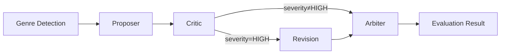

# venus-core

**AI Photography Evaluation Engine** — A multi-agent adversarial evaluation system for professional photography scoring.

[English](./README.md) | [中文](./README.zh-CN.md)

[](./LICENSE)
[](https://www.npmjs.com/package/@theogony/venus-core)
[](https://www.typescriptlang.org/)

---

## Overview

Venus Core implements a **four-round adversarial evaluation pipeline** for professional photography assessment:



| Round | Agent | Role |
|------:|-------|------|
| 0 | Genre Detector | Auto-detects the photography genre via VLM (optional) |
| 1 | **Proposer** | Analyzes the image and produces an initial score with per-dimension breakdowns |
| 2 | **Critic** | Challenges the proposal, identifying scoring biases and errors |
| 3 | **Revision** _(conditional)_ | If the critique severity is `HIGH`, the proposer revises its assessment |
| 4 | **Arbiter** | Makes the final ruling, synthesizing all preceding evidence |

The engine supports **8 photography genres**, each with genre-specific scoring dimensions, scene subtypes, and professional evaluation standards.

## Features

- **Multi-Agent Adversarial Pipeline** — Proposer → Critic → Revision → Arbiter ensures robust, bias-mitigated scoring
- **8 Photography Genres** — Portrait, Landscape, Documentary, Fine Art, Commercial, Architecture, Nature, Sports
- **Multi-Model Routing** — Per-agent model selection and per-agent custom LLM providers
- **Multi-Provider Reasoning** — Auto-adapts reasoning params to Qwen (DashScope), Kimi (Moonshot), and Doubao (Volcano Ark)
- **Dual Evaluation API** — `evaluate()` for synchronous results, `evaluateStream()` for SSE-ready streaming
- **Streaming Granularity** — Two streaming modes: `values` (milestone events only) and `updates` (real-time reasoning + JSON partials)
- **Context Extension** — Rich `EvaluationContext` with EXIF metadata, user notes, and custom data with genre-aware injection depth
- **Event System** — `onEvent` callback for real-time observability into each pipeline stage
- **Web Framework Adapters** — First-class Hono and Express integration with shared Zod validation and lifecycle hooks
- **Chain-of-Thought** — Per-agent reasoning effort and token budget with cross-provider auto-adaptation
- **Dynamic Zod Schemas** — Per-genre schema generation with caching for input and output validation
- **Structured Errors** — Fine-grained error hierarchy with provider-level error codes
- **Full TypeScript** — Complete type definitions for all public APIs

## Quick Start

```bash
npm install @theogony/venus-core
# or
bun add @theogony/venus-core
```

```ts
import { createVenusEngine, createOpenAIChatProvider } from '@theogony/venus-core';

const engine = createVenusEngine({
  provider: createOpenAIChatProvider({
    baseURL: 'https://dashscope.aliyuncs.com/compatible-mode/v1',
    apiKey: process.env.API_KEY!,
  }),
  defaultModel: '<your-model>',
});

const result = await engine.evaluate('https://example.com/photo.jpg');
console.log(result.totalScore);        // 8.2
console.log(result.genre);             // 'landscape'
console.log(result.dimensions);        // { composition_depth: 8.5, ... }
console.log(result.critique);          // Detailed textual critique
console.log(result.suggestions);       // Improvement suggestions
console.log(result.arbitrationNotes);  // Arbiter's rationale
```

You can also stream evaluation progress for real-time updates:

```ts
for await (const event of engine.evaluateStream('https://example.com/photo.jpg')) {
  switch (event.type) {
    case 'genre_detected':
      console.log('Detected:', event.data.genre);
      break;
    case 'evaluation_complete':
      console.log('Score:', event.data.totalScore); // 8.2
      break;
  }
}
```

---

## Documentation

| Document | Description |
|----------|-------------|
| [API Reference](./docs/en/api-reference.md) | Complete type signatures for engine, providers, schemas, and errors |
| [Usage Guide](./docs/en/usage-guide.md) | Streaming, web framework integration, adapter hooks, context extension, event system |
| [Configuration](./docs/en/configuration.md) | `VenusEngineConfig` full reference and reasoning configuration |

---

## Photography Genres

| Genre | Key | Dimensions | Subtypes |
|-------|-----|-----------|----------|
| Portrait | `portrait` | Expression, Pose, Lighting, Color, Composition | Studio, Environmental, Wedding |
| Landscape | `landscape` | Composition, Light, Color, Sharpness, Emotion | Natural, Urban, Seascape, Astro |
| Documentary | `documentary` | Storytelling, Moment, Composition, Authenticity, Emotion | News, Street, Social |
| Fine Art | `fine_art` | Concept, Visual Language, Craft, Originality, Aesthetics | Conceptual, Abstract, Experimental |
| Commercial | `commercial` | Subject, Lighting, Styling, Color, Market Appeal | Product, Fashion |
| Architecture | `architecture` | Perspective, Space, Light/Material, Context, Narrative | Interior, Exterior |
| Nature | `nature` | Capture, Focus, Habitat, Technical, Natural Wonder | Wildlife, Flora, Macro |
| Sports | `sports` | Peak Action, Timing, Framing, Technical, Drama | Action, Extreme |

---

## Installation

```bash
npm install @theogony/venus-core
# or
bun add @theogony/venus-core
```

### Peer Dependencies

| Package | Required | Notes |
|---------|----------|-------|
| `openai` ^6.39 | **Yes** | OpenAI SDK for OpenAI Chat/Responses providers |
| `zod` ^4.4 | **Yes** | Schema validation |
| `vectorjson` ^0.5 | **Yes** | Streaming JSON incremental parsing |
| `@anthropic-ai/sdk` ^0.98 | Optional | For Anthropic provider |
| `@google/genai` ^2.6 | Optional | For Gemini provider |
| `hono` ^4.12 | Optional | For Hono adapter (`@theogony/venus-core/hono`) |
| `express` ^5.2 | Optional | For Express adapter (`@theogony/venus-core/express`) |

### Runtime Support

- **Node.js** >= 18.0.0
- **Bun** (recommended for development/testing)
- **Deno**, **Cloudflare Workers** (Hono adapter)

---

## License

[Apache-2.0](./LICENSE)

Copyright 2026 Venus Contributors
