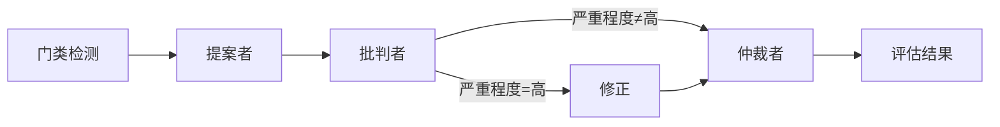

# venus-core

**AI 摄影评分引擎** — 基于多智能体对抗机制的专业摄影评分系统。

[English](./README.md) | [中文](./README.zh-CN.md)

[](./LICENSE)
[](https://www.npmjs.com/package/@theogony/venus-core)
[](https://www.typescriptlang.org/)

---

## 概述

Venus Core 实现了一套**四轮对抗式评估管线**，用于专业摄影评分：



| 轮次 | 智能体 | 职责 |
|------:|--------|------|
| 0 | 门类检测器 | 通过 VLM 自动识别摄影门类（可选） |
| 1 | **提案者** | 分析图片并给出带有各维度分数的初始评估 |
| 2 | **批判者** | 挑战提案，识别评分偏差与错误 |
| 3 | **修正** _(条件触发)_ | 当批判严重程度为 `HIGH` 时，提案者修正其评估 |
| 4 | **仲裁者** | 综合所有证据做出最终裁决 |

引擎支持 **8 大摄影门类**，每个门类均有专属的评分维度、场景子类型和专业评审标准。

## 特性

- **多智能体对抗管线** — 提案者 → 批判者 → 修正 → 仲裁者，确保评分稳健、减少偏差
- **8 大摄影门类** — 人像、风光、纪实、艺术、商业、建筑、自然、体育
- **多模型路由** — 支持按智能体选择模型和自定义 LLM 提供商
- **双模式评估 API** — `evaluate()` 同步返回结果，`evaluateStream()` 支持 SSE 流式输出
- **流式粒度控制** — 两种流模式：`values`（仅里程碑事件）和 `updates`（实时思维链 + JSON 增量）
- **上下文扩展** — 丰富的 `EvaluationContext`，支持 EXIF 元数据、用户备注和自定义数据，按门类智能注入
- **事件系统** — `onEvent` 回调实现对每个管线阶段的实时可观测性
- **Web 框架适配器** — 一流的 Hono 和 Express 集成，共享 Zod 校验
- **思维链支持** — 按智能体配置思考/推理预算，跨模型 CoT 提取
- **动态 Zod Schema** — 按门类生成 Schema 并缓存，用于输入输出校验
- **结构化错误** — 细粒度错误层级，含提供商级别错误码
- **完整 TypeScript** — 所有公共 API 均有完整类型定义

## 快速开始

```bash
npm install @theogony/venus-core
# 或
bun add @theogony/venus-core
```

```ts
import { createVenusEngine } from '@theogony/venus-core';

const engine = createVenusEngine({
  baseURL: 'https://dashscope.aliyuncs.com/compatible-mode/v1',
  apiKey: process.env.API_KEY!,
  defaultModel: 'qwen3-vl-flash',
});

const result = await engine.evaluate('https://example.com/photo.jpg');
console.log(result.totalScore);        // 8.2
console.log(result.genre);             // 'landscape'
console.log(result.dimensions);        // { composition_depth: 8.5, ... }
console.log(result.critique);          // 详细文字点评
console.log(result.suggestions);       // 改进建议
console.log(result.arbitrationNotes);  // 仲裁者裁定理由
```

---

## API 参考

### 核心引擎

#### `createVenusEngine(config: VenusEngineConfig): VenusEngine`

工厂函数，用于创建引擎实例。

#### `engine.evaluate(imageUrl, genre?, context?): Promise<EvaluationResult>`

执行完整评估。所有轮次完成后返回结果。

| 参数 | 类型 | 说明 |
|-----------|------|-------------|
| `imageUrl` | `string` | 待评估图片的 URL |
| `genre` | `Genre` | 可选的门类覆盖；省略时自动检测 |
| `context` | `EvaluationContext` | 可选的上下文，包含 EXIF 数据、用户备注和自定义元数据 |

返回 `EvaluationResult`：

```ts
interface EvaluationResult {
  imageUrl: string;
  genre: Genre;
  sceneType: string;
  totalScore: number;
  dimensions: Record<string, number>;
  critique: string;
  suggestions: string;
  arbitrationNotes: string;
  process: {
    genreDetection?: AgentCallResult<{ genre: Genre; confidence: number }>;
    proposal: AgentCallResult<ProposerResult>;
    critique: AgentCallResult<CritiqueResult>;
    revision?: AgentCallResult<ProposerResult>;
    arbitration: AgentCallResult<ArbitrationResult>;
  };
  metadata: {
    evaluatedAt: string;
    durationMs: number;
    rounds: 3 | 4;
    context?: EvaluationContext;
  };
}
```

#### `engine.evaluateStream(imageUrl, options?): AsyncGenerator<EvaluationStreamEvent>`

流式评估，在每个阶段产出事件：

| 事件类型 | 说明 |
|------------|-------------|
| `evaluation_start` | 评估已开始 |
| `genre_detected` | 门类自动检测结果（含思维链） |
| `agent_call` | 某个智能体轮次开始 |
| `thinking_chunk` | 实时思维/推理文本（仅 `updates` 模式） |
| `result_chunk` | 增量 JSON 片段（仅 `updates` 模式） |
| `agent_complete` | 某个智能体轮次完成（含结果 + 思维链） |
| `evaluation_complete` | 最终结果就绪 |
| `error` | 发生错误 |

`EvaluateStreamOptions`：

| 选项 | 类型 | 默认值 | 说明 |
|--------|------|---------|-------------|
| `genre` | `Genre \| null` | — | 预先指定门类（跳过自动检测） |
| `context` | `EvaluationContext` | — | 附加评估上下文 |
| `mode` | `'values' \| 'updates'` | `'values'` | 流式粒度模式 |

**模式对比：**

| 模式 | 行为 |
|------|----------|
| `values` | 仅发送里程碑事件：`agent_call`、`agent_complete`、`evaluation_start`、`genre_detected`、`evaluation_complete`、`error` |
| `updates` | 包含 `values` 全部事件，外加实时 `thinking_chunk` 和 `result_chunk` 事件用于增量 UI 更新 |

### Schema 与门类工具

#### `GenreEnum`

所有 8 个摄影门类的 Zod 枚举：

```ts
import { GenreEnum } from '@theogony/venus-core';
// z.enum(['portrait','landscape','documentary','fine_art','commercial','architecture','nature','sports'])
```

#### `ExifDataSchema` / `EvaluationContextSchema`

`ExifData` 和 `EvaluationContext` 的 Zod Schema，导出供消费端校验使用：

```ts
import { ExifDataSchema, EvaluationContextSchema } from '@theogony/venus-core';

const exif = ExifDataSchema.parse({ shutterSpeed: '1/2000', iso: 400 });
const ctx = EvaluationContextSchema.parse({ exif, userNotes: '...' });
```

#### `getSchemas(genre: Genre)`

返回 `{ proposalSchema, critiqueSchema, arbiterSchema }` — 指定门类的 Zod Schema。

#### `getGenreConfig(genre: Genre): GenreConfig`

返回某个门类的完整配置，包括标签、维度和子类型。

```ts
import { getGenreConfig } from '@theogony/venus-core';

const cfg = getGenreConfig('portrait');
console.log(cfg.label);             // '人像摄影'
console.log(cfg.dimensions);        // ['facial_expression', 'pose_body', ...]
console.log(cfg.dimensionLabels);   // ['神态', '姿态', ...]
console.log(cfg.subtypes);          // ['studio', 'environmental', 'wedding']
```

#### `getMetadata(): Record<string, GenreMetadata>`

返回所有门类的元数据，包括标签、维度和子类型。适用于构建 UI。

```ts
import { getMetadata } from '@theogony/venus-core';

const metadata = getMetadata();
// { portrait: { label: '人像摄影', dimensions: [...], subtypes: [...] }, ... }
```

#### `getAllGenres(): string[]`

返回所有已注册门类键名的数组。

### 提供商

#### `createOpenAICompatProvider(options: OpenAICompatOptions): LLMProvider`

为任何 OpenAI 兼容 API 创建提供商（OpenAI、DashScope、Together、vLLM 等）。

```ts
import { createOpenAICompatProvider } from '@theogony/venus-core';

const provider = createOpenAICompatProvider({
  baseURL: 'https://api.together.xyz/v1',
  apiKey: process.env.TOGETHER_KEY!,
  defaultModel: 'meta-llama/Llama-4-Maverick-17B-128E-Instruct-FP8',
  timeout: 120_000,
  headers: { 'Custom-Header': 'value' },
  defaultExtra: { /* 厂商特定参数 */ },
});
```

| 选项 | 类型 | 默认值 | 说明 |
|--------|------|---------|-------------|
| `baseURL` | `string` | *必填* | API 基础 URL |
| `apiKey` | `string` | *必填* | API 密钥 |
| `defaultModel` | `string` | — | 默认模型标识 |
| `headers` | `Record<string, string>` | — | 额外 HTTP 头 |
| `timeout` | `number` | — | 请求超时（毫秒） |
| `defaultExtra` | `Record<string, unknown>` | — | 厂商特定额外参数 |

#### `defineProvider(options: DefineProviderOptions): LLMProvider`

通过直接实现 `chat()` 方法创建完全自定义的提供商。

| 选项 | 类型 | 默认值 | 说明 |
|--------|------|---------|-------------|
| `name` | `string` | *必填* | 用于日志的提供商名称 |
| `supportsVision` | `boolean` | `false` | 提供商是否支持图像输入 |
| `supportsThinking` | `boolean` | `false` | 提供商是否支持思维链 |
| `chat` | `(params: ChatParams) => Promise<ChatResponse>` | *必填* | 聊天补全实现 |
| `chatStream` | `(params: ChatParams) => AsyncIterable<StreamChunk>` | — | 可选的流式实现 |

```ts
import { createVenusEngine, defineProvider } from '@theogony/venus-core';

const myProvider = defineProvider({
  name: 'my-llm',
  supportsVision: true,
  supportsThinking: false,
  async chat(params) {
    const res = await fetch('https://my-llm-api.com/chat', {
      method: 'POST',
      headers: { 'Content-Type': 'application/json' },
      body: JSON.stringify({ model: params.model, messages: params.messages }),
    });
    const data = await res.json();
    return { content: data.text, thinking: null };
  },
});

const engine = createVenusEngine({
  baseURL: 'https://api.openai.com/v1',
  apiKey: process.env.API_KEY!,
  providers: {
    proposer: myProvider,
    critic: myProvider,
    // arbiter 使用默认的 OpenAI 兼容提供商
  },
});
```

### 错误类

所有错误均继承 `VenusError` 并带有 `code` 属性：

| 错误类 | 代码 | 说明 |
|-------------|------|-------------|
| `VenusError` | `VENUS_ERROR` | 基础错误类 |
| `ValidationError` | `VALIDATION_ERROR` | 输入无效（URL 错误、未知门类） |
| `ProviderError` | `PROVIDER_ERROR` | LLM 提供商故障 |
| `SchemaError` | `SCHEMA_ERROR` | 智能体输出 Schema 校验失败 |
| `TimeoutError` | `TIMEOUT_ERROR` | 评估超时 |

`ProviderError` 包含用于细粒度诊断的额外字段：
- `provider: string` — 失败提供商的名称
- `errorCode: ProviderErrorCode` — 以下之一：`'network' | 'api_error' | 'parse_error' | 'timeout' | 'auth_error' | 'unknown'`
- `statusCode?: number` — HTTP 状态码（如适用）

```ts
import { ProviderError, ValidationError } from '@theogony/venus-core';

try {
  const result = await engine.evaluate(imageUrl);
} catch (err) {
  if (err instanceof ProviderError) {
    console.error(`提供商 ${err.provider} 调用失败: [${err.errorCode}] ${err.message}`);
  } else if (err instanceof ValidationError) {
    console.error(`输入无效: ${err.message}`);
  }
}
```

### 类型导出

所有公共类型均重新导出供消费者使用：

```ts
import type {
  Genre,
  GenreConfig,
  GenreMetadata,
  SubtypeForGenre,
  DimensionForGenre,
  ExifData,
  EvaluationContext,
  EvaluationResult,
  EvaluationStreamEvent,
  EvaluateStreamOptions,
  StreamMode,
  LLMProvider,
  ChatParams,
  ChatResponse,
  ChatMessage,
  StreamChunk,
  VenusEngineConfig,
  ProviderErrorCode,
  AgentRole,
  AgentConfig,
  AgentCallResult,
  ProposerResult,
  ArbitrationResult,
  ModelConfig,
  ProviderConfig,
  ThinkingConfig,
  AdapterOptions,
  MetadataResponse,
} from '@theogony/venus-core';
```

---

## 使用示例

### 基本评估

传入图片 URL，可选指定门类。省略时引擎会自动检测。

```ts
// 自动检测门类
const result = await engine.evaluate('https://example.com/photo.jpg');

// 明确指定门类
const result = await engine.evaluate('https://example.com/portrait.jpg', 'portrait');
```

### 流式评估

`evaluateStream()` 返回一个 `AsyncGenerator`，在管线的每个阶段产出事件 — 非常适合 SSE 或实时 UI。

```ts
for await (const event of engine.evaluateStream('https://example.com/photo.jpg')) {
  switch (event.type) {
    case 'genre_detected':
      console.log('门类:', event.data.genre);
      break;
    case 'agent_complete':
      console.log(`第 ${event.round} 轮 [${event.agent}] 完成`);
      break;
    case 'evaluation_complete':
      console.log('最终评分:', event.data.totalScore);
      break;
    case 'error':
      console.error(event.error.message);
      break;
  }
}
```

#### `updates` 模式流式

如需实时思维链和增量 JSON 片段，使用 `mode: 'updates'`：

```ts
for await (const event of engine.evaluateStream('https://example.com/photo.jpg', {
  mode: 'updates',
})) {
  switch (event.type) {
    case 'thinking_chunk':
      // 实时流式输出智能体推理过程
      process.stdout.write(event.content);
      break;
    case 'result_chunk':
      // 增量 JSON — 逐步更新 UI
      updateProgressBar(event.partial);
      break;
    case 'agent_complete':
      // 智能体完成 — 最终结果可用
      break;
  }
}
```

### Web 框架集成

#### Hono（推荐）

```ts
import { Hono } from 'hono';
import { createVenusEngine } from '@theogony/venus-core';
import { createHonoAdapter } from '@theogony/venus-core/hono';

const engine = createVenusEngine({
  baseURL: 'https://dashscope.aliyuncs.com/compatible-mode/v1',
  apiKey: process.env.API_KEY!,
});

const app = new Hono();
app.route('/api', createHonoAdapter(engine));

export default app; // 适用于 Bun、Deno、Node、Cloudflare Workers 等
```

#### Express

```ts
import express from 'express';
import { createVenusEngine } from '@theogony/venus-core';
import { createExpressAdapter } from '@theogony/venus-core/express';

const engine = createVenusEngine({
  baseURL: 'https://dashscope.aliyuncs.com/compatible-mode/v1',
  apiKey: process.env.API_KEY!,
});

const app = express();
app.use(express.json());
app.use('/api', createExpressAdapter(engine));
app.listen(3000);
```

两种适配器暴露相同的端点：

| 方法 | 路径 | 说明 |
|--------|------|-------------|
| `POST` | `/evaluate` | 同步评估 |
| `POST` | `/evaluate/stream` | 流式评估（SSE） |
| `GET` | `/metadata` | 门类元数据和维度信息 |

### 上下文扩展

Venus 支持通过 `EvaluationContext` 传递额外上下文以增强评估准确性。上下文数据贯穿整个对抗管线 — 提案者、批判者和仲裁者 — 并在结果元数据中返回。

#### EXIF 数据

将 EXIF 元数据作为一等公民传入。引擎会将 EXIF 参数按**门类感知的注入深度**格式化到智能体提示中：

```ts
const result = await engine.evaluate(
  'https://example.com/photo.jpg',
  'portrait',
  {
    exif: {
      shutterSpeed: '1/2000',
      iso: 400,
      fNumber: 2.8,
      focalLength: 85,
      cameraModel: 'SONY ILCE-7M4',
      lensModel: 'FE 85mm F1.4 GM',
      dateTimeOriginal: '2026:03:15 14:30:00',
    },
  },
);
```

#### 用户备注

提供自由文本备注，让智能体了解拍摄条件或创作意图的额外上下文：

```ts
const result = await engine.evaluate(
  'https://example.com/photo.jpg',
  'landscape',
  {
    userNotes: 'Shot at sunrise with a GND graduated filter to darken the sky',
  },
);
```

#### 完整上下文示例

组合 EXIF、用户备注和自定义元数据：

```ts
const result = await engine.evaluate(imageUrl, 'sports', {
  exif: { shutterSpeed: '1/4000', iso: 1600, focalLength: 400 },
  userNotes: '2026 National Athletics Championships - 100m Final',
  custom: { event: 'National Athletics Championship' },
});

// 上下文在结果元数据中返回
console.log(result.metadata.context?.exif);      // { shutterSpeed: '1/4000', ... }
console.log(result.metadata.context?.userNotes);  // '2026 National Athletics ...'
```

#### 通过 Web 框架适配器传递上下文

适配器（Hono / Express）会透明地将请求体中的 `context` 传递给引擎：

```bash
curl -X POST http://localhost:3000/api/evaluate \
  -H 'Content-Type: application/json' \
  -d '{
    "imageUrl": "https://example.com/photo.jpg",
    "genre": "portrait",
    "context": {
      "exif": { "shutterSpeed": "1/2000", "fNumber": 2.8, "iso": 400 },
      "userNotes": "Natural light outdoor portrait"
    }
  }'
```

Schema 校验自动应用：`userNotes` 限制为 2000 字符，所有 EXIF 字段均为可选。

#### 门类感知的注入深度

EXIF 数据根据摄影门类以不同强度注入提示：

| 注入级别 | 门类 | 行为 |
|----------------|--------|----------|
| **高** | 体育、自然 | EXIF 参数（快门、焦距）被强调为与评估直接相关 |
| **标准** | 人像、风光 | EXIF 作为参考参数显示 |
| **轻量** | 建筑、商业、纪实 | 紧凑的单行摘要，不强调 |
| **最小** | 艺术 | 明确注明仅供参考；艺术表达优先 |

始终附加免责声明：*"EXIF 数据可能经过后期处理修改；实际视觉效果为最终评判依据。"*

### 事件系统

通过 `onEvent` 订阅管线事件：

```ts
const engine = createVenusEngine({
  baseURL: 'https://dashscope.aliyuncs.com/compatible-mode/v1',
  apiKey: process.env.API_KEY!,
  onEvent(event) {
    console.log(`[${event.type}] 轮次=${event.round} 智能体=${event.agent}`);
  },
});
```

| 事件类型 | 负载 |
|------------|---------|
| `round_start` | `{ round, agent, data }` |
| `round_complete` | `{ round }` |
| `agent_call` | `{ round, agent }` |
| `agent_complete` | `{ round, agent, data: { result, thinking } }` |
| `error` | `{ agent, data: { error } }` |

---

## 摄影门类

| 门类 | 键名 | 评分维度 | 子类型 |
|-------|-----|-----------|----------|
| 人像 | `portrait` | 神态、姿态、光影、色彩、构图 | 棚拍/写真、环境人像/旅拍、婚礼 |
| 风光 | `landscape` | 构图纵深、光线气氛、色彩和谐、锐度细节、情感共鸣 | 自然风光、城市风光、海景、星空/天文 |
| 纪实 | `documentary` | 叙事、瞬间、构图、真实、情感 | 新闻纪实、街头摄影、社会纪实 |
| 艺术 | `fine_art` | 概念、视觉、工艺、原创、美学 | 观念摄影、抽象摄影、实验摄影 |
| 商业 | `commercial` | 主体、布光、造型、色彩、市场 | 产品摄影、时尚摄影 |
| 建筑 | `architecture` | 透视、空间、光材、环境、叙事 | 室内建筑、室外建筑 |
| 自然 | `nature` | 捕捉、对焦、环境、技术、自然美 | 野生动物、植物、微距 |
| 体育 | `sports` | 巅峰动作、时机、取景、执行、戏剧 | 竞技运动、极限运动 |

---

## 配置参考

`VenusEngineConfig` 完整参考：

| 选项 | 类型 | 默认值 | 说明 |
|--------|------|---------|-------------|
| `baseURL` | `string` | *必填* | OpenAI 兼容 API 基础 URL |
| `apiKey` | `string` | *必填* | API 密钥 |
| `defaultModel` | `string` | `'qwen3-vl-flash'` | 所有智能体的默认模型 |
| `models` | `ModelConfig` | — | 按智能体覆盖模型（`genreDetector`、`proposer`、`critic`、`arbiter`、`revision`） |
| `providers` | `ProviderConfig` | — | 按智能体自定义提供商实例 |
| `thinking` | `ThinkingConfig` | — | 思维链配置，支持全局 `enabled` 和按智能体 `agents` 覆盖 |
| `maxRetries` | `number` | — | 每次智能体 LLM 调用的最大重试次数 |
| `timeout` | `number` | — | 请求超时时间（毫秒） |
| `onEvent` | `(event: EvaluationEvent) => void` | — | 用于可观测性的事件回调 |

### 思维链配置

```ts
interface ThinkingConfig {
  /** 全局默认值（默认 false）。可被按智能体覆盖 */
  enabled?: boolean;
  /** 按智能体覆盖配置 */
  agents?: Partial<Record<AgentRole, {
    enabled?: boolean;   // 覆盖全局 enabled
    budget?: number;     // 思维链 token 预算
  }>>;
}
```

完整配置示例：

```ts
const engine = createVenusEngine({
  baseURL: 'https://dashscope.aliyuncs.com/compatible-mode/v1',
  apiKey: process.env.API_KEY!,
  defaultModel: 'qwen3-vl-flash',
  models: {
    proposer: 'qwen3-vl-flash',
    critic: 'qwen3-vl-flash',
    arbiter: 'qwen3-vl-flash',
  },
  thinking: {
    enabled: true,
    agents: {
      proposer: { budget: 4096 },
      critic: { budget: 4096 },
      arbiter: { budget: 8192 },
      genreDetector: { enabled: false },
    },
  },
  onEvent(event) {
    console.log(`[${event.type}] 轮次=${event.round} 智能体=${event.agent}`);
  },
});
```

---

## 安装

```bash
npm install @theogony/venus-core
# 或
bun add @theogony/venus-core
```

### Peer 依赖

| 包名 | 是否必需 | 说明 |
|---------|----------|-------|
| `openai` ^6.38 | **是** | 默认提供商的 OpenAI SDK |
| `zod` ^4.4 | **是** | Schema 校验 |
| `vectorjson` ^0.5 | **是** | 流式 JSON 增量解析 |
| `hono` ^4.12 | 可选 | 用于 Hono 适配器（`@theogony/venus-core/hono`） |
| `express` ^5.2 | 可选 | 用于 Express 适配器（`@theogony/venus-core/express`） |

### 运行时支持

- **Node.js** >= 18.0.0
- **Bun**（推荐用于开发/测试）
- **Deno**、**Cloudflare Workers**（Hono 适配器）

---

## 许可证

[Apache-2.0](./LICENSE)

Copyright 2026 Venus Contributors
