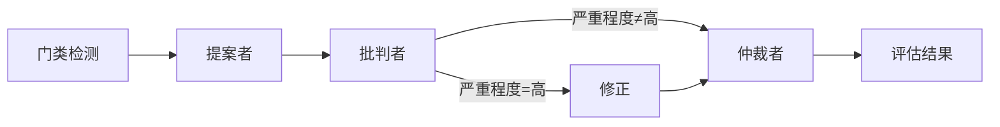

# venus-core

**AI 摄影评分引擎** — 基于多智能体对抗机制的专业摄影评分系统。

[English](./README.md) | [中文](./README.zh-CN.md)

[](./LICENSE)
[](https://www.npmjs.com/package/@theogony/venus-core)
[](https://www.typescriptlang.org/)

---

## 概述

Venus Core 实现了一套**四轮对抗式评估管线**，用于专业摄影评分：



| 轮次 | 智能体 | 职责 |
|------:|--------|------|
| 0 | 门类检测器 | 通过 VLM 自动识别摄影门类（可选） |
| 1 | **提案者** | 分析图片并给出带有各维度分数的初始评估 |
| 2 | **批判者** | 挑战提案，识别评分偏差与错误 |
| 3 | **修正** _(条件触发)_ | 当批判严重程度为 `HIGH` 时，提案者修正其评估 |
| 4 | **仲裁者** | 综合所有证据做出最终裁决 |

引擎支持 **8 大摄影门类**，每个门类均有专属的评分维度、场景子类型和专业评审标准。

## 特性

- **多智能体对抗管线** — 提案者 → 批判者 → 修正 → 仲裁者，确保评分稳健、减少偏差
- **8 大摄影门类** — 人像、风光、纪实、艺术、商业、建筑、自然、体育
- **多模型路由** — 支持按智能体选择模型和自定义 LLM 提供商
- **多提供商推理适配** — 自动适配 Qwen（通义千问）、Kimi（月之暗面）和豆包 (火山方舟) 的推理参数
- **双模式评估 API** — `evaluate()` 同步返回结果，`evaluateStream()` 支持 SSE 流式输出
- **流式粒度控制** — 两种流模式：`values`（仅里程碑事件）和 `updates`（实时推理 + JSON 增量）
- **上下文扩展** — 丰富的 `EvaluationContext`，支持 EXIF 元数据、用户备注和自定义数据，按门类智能注入
- **事件系统** — `onEvent` 回调实现对每个管线阶段的实时可观测性
- **Web 框架适配器** — 一流的 Hono 和 Express 集成，共享 Zod 校验与生命周期钩子
- **推理链支持** — 按智能体配置推理 effort 级别和 token 预算，跨提供商自动适配
- **动态 Zod Schema** — 按门类生成 Schema 并缓存，用于输入输出校验
- **结构化错误** — 细粒度错误层级，含提供商级别错误码
- **完整 TypeScript** — 所有公共 API 均有完整类型定义

## 快速开始

```bash
npm install @theogony/venus-core
# 或
bun add @theogony/venus-core
```

```ts
import { createVenusEngine, createOpenAIChatProvider } from '@theogony/venus-core';

const engine = createVenusEngine({
  provider: createOpenAIChatProvider({
    baseURL: 'https://dashscope.aliyuncs.com/compatible-mode/v1',
    apiKey: process.env.API_KEY!,
  }),
  defaultModel: '<your-model>',
});

const result = await engine.evaluate('https://example.com/photo.jpg');
console.log(result.totalScore);        // 8.2
console.log(result.genre);             // 'landscape'
console.log(result.dimensions);        // { composition_depth: 8.5, ... }
console.log(result.critique);          // 详细文字点评
console.log(result.suggestions);       // 改进建议
console.log(result.arbitrationNotes);  // 仲裁者裁定理由
```

你也可以流式获取评估进度，适合实时更新：

```ts
for await (const event of engine.evaluateStream('https://example.com/photo.jpg')) {
  switch (event.type) {
    case 'genre_detected':
      console.log('检测到门类:', event.data.genre);
      break;
    case 'evaluation_complete':
      console.log('总分:', event.data.totalScore); // 8.2
      break;
  }
}
```

---

## 文档

| 文档 | 说明 |
|----------|-------------|
| [API 参考](./docs/zh-CN/api-reference.md) | 引擎、提供商、Schema 和错误的完整类型签名 |
| [使用指南](./docs/zh-CN/usage-guide.md) | 流式评估、Web 框架集成、适配器钩子、上下文扩展、事件系统 |
| [配置参考](./docs/zh-CN/configuration.md) | `VenusEngineConfig` 完整参考和推理配置 |

---

## 摄影门类

| 门类 | 键名 | 评分维度 | 子类型 |
|-------|-----|-----------|----------|
| 人像 | `portrait` | 神态、姿态、光影、色彩、构图 | 棚拍/写真、环境人像/旅拍、婚礼 |
| 风光 | `landscape` | 构图纵深、光线气氛、色彩和谐、锐度细节、情感共鸣 | 自然风光、城市风光、海景、星空/天文 |
| 纪实 | `documentary` | 叙事、瞬间、构图、真实、情感 | 新闻纪实、街头摄影、社会纪实 |
| 艺术 | `fine_art` | 概念、视觉、工艺、原创、美学 | 观念摄影、抽象摄影、实验摄影 |
| 商业 | `commercial` | 主体、布光、造型、色彩、市场 | 产品摄影、时尚摄影 |
| 建筑 | `architecture` | 透视、空间、光材、环境、叙事 | 室内建筑、室外建筑 |
| 自然 | `nature` | 捕捉、对焦、环境、技术、自然美 | 野生动物、植物、微距 |
| 体育 | `sports` | 巅峰动作、时机、取景、执行、戏剧 | 竞技运动、极限运动 |

---

## 安装

```bash
npm install @theogony/venus-core
# 或
bun add @theogony/venus-core
```

### Peer 依赖

| 包名 | 是否必需 | 说明 |
|---------|----------|-------|
| `openai` ^6.39 | **是** | OpenAI SDK，用于 OpenAI Chat/Responses 提供商 |
| `zod` ^4.4 | **是** | Schema 校验 |
| `vectorjson` ^0.5 | **是** | 流式 JSON 增量解析 |
| `@anthropic-ai/sdk` ^0.98 | 可选 | 用于 Anthropic 提供商 |
| `@google/genai` ^2.6 | 可选 | 用于 Gemini 提供商 |
| `hono` ^4.12 | 可选 | 用于 Hono 适配器（`@theogony/venus-core/hono`） |
| `express` ^5.2 | 可选 | 用于 Express 适配器（`@theogony/venus-core/express`） |

### 运行时支持

- **Node.js** >= 18.0.0
- **Bun**（推荐用于开发/测试）
- **Deno**、**Cloudflare Workers**（Hono 适配器）

---

## 许可证

[Apache-2.0](./LICENSE)

Copyright 2026 Venus Contributors
